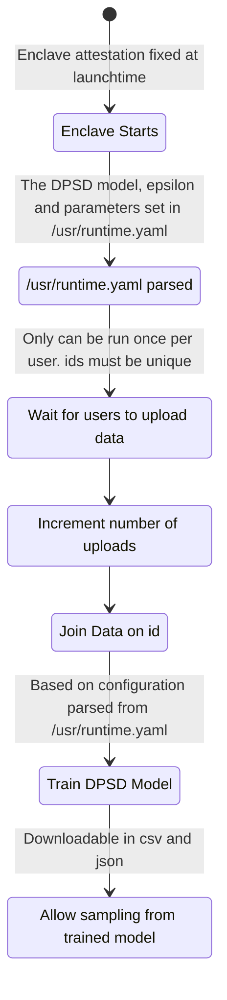

# Differentially Private Synthetic Data from Multiple Private Data Sources :rocket:


What we'll cover in this tutorial:
- developing with oblivious (OBLV), opendp-smartnoise and fastapi
    - recieving input csv files from clients
    - join tabular data in enclave
    - generate DPSD from joint table
    - allow sampling of SD
    - runtime arguments
- local testing
    - some basic unit tests
- configuring, deploying and connecting
    - configure repo to be valid service
    - create client keys
    - deploy to enclave
    - connect to and interact with the enclave application 

### Repo Layout

```
.
├── Dockerfile                      # for local testing and building
├── LICENSE
├── README.md
├── requirements.txt
├── src
│   ├── app.py                      # all url paths handlers
│   ├── config.py                   # gets config settings from /usr/runtime.yaml
│   ├── models
│   │   ├── DPCTGAN.py              # specific model from SmartNoise
│   │   ├── MTS.py                  # specific model from SmartNoise
│   │   ├── MWEM.py                 # specific model from SmartNoise <-- recommended to use as a template for future models
│   │   ├── PATECTGAN.py            # specific model from SmartNoise
│   │   ├── __init__.py             # lists valid models <-- add to here if adding new DPSD model
│   │   └── base.py                 # Base SD abstract method with general methods (set data, export results, etc)
│   └── uvicorn_serve.py            # boilerplate serving of the fastapi server
└── tests
    ├── example_data                # example data from UCI Datasets: Car Rating
    │   ├── alice.csv
    │   └── bob.csv
    ├── test_general.py             # placeholder for testing
    └── yaml
        ├── runtime_dpctgan.yaml    # example /usr/runtime.yaml files
        ├── runtime_mts.yaml
        ├── runtime_mwem_1.yaml
        ├── runtime_mwem_2.yaml
        └── runtime_patectgan.yaml 
```

### System Flow


